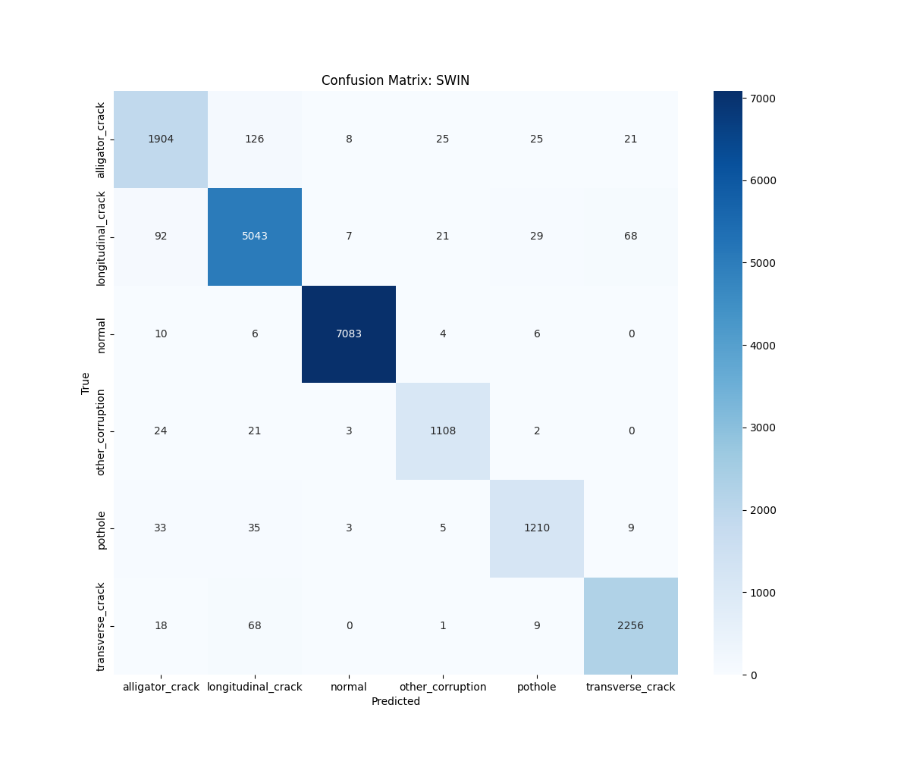
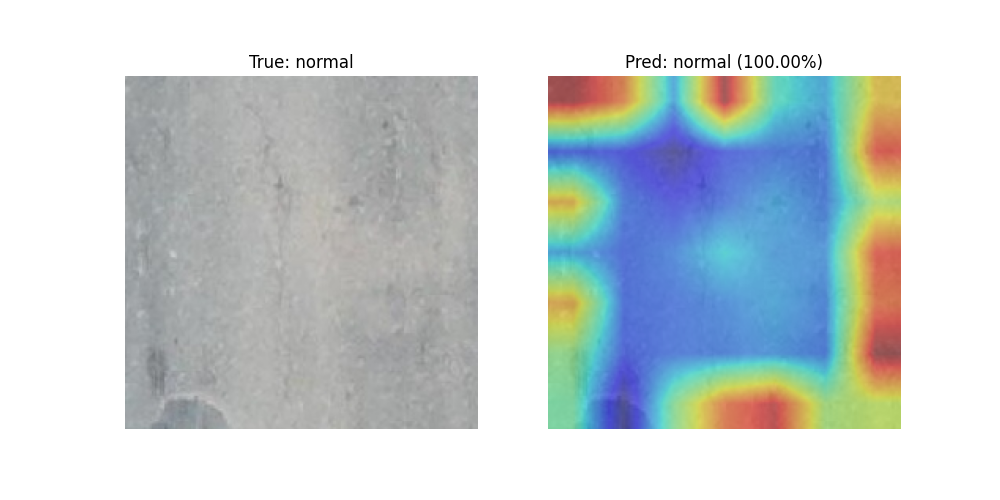

# Road Damage Detection & Classification

Detecting and classifying road surface damage (cracks, potholes) on the international **RDD2022** dataset — a two-part university project at OTH Regensburg.

| Part | Task | Models |
|---|---|---|
| **HSP 1** | Real-time detection (bounding boxes) | YOLO11 (Ultralytics) |
| **HSP 2** | Fine-grained damage classification | Vision Transformer (ViT-B/16) vs. Swin Transformer (Swin-T) |

## Results (HSP 2, test set: 14,463 crops)

| Model | Accuracy | Macro F1 | F1 alligator crack (hardest class) |
|---|---|---|---|
| ViT-B/16 | 0.96 | 0.94 | 0.89 |
| **Swin-T** | **0.96** | **0.95** | **0.90** |

- Both models separate damage from intact asphalt almost perfectly (F1 ≈ 1.00 for "normal").
- Swin's shifted-window attention handles fine, branching crack patterns better: fewer alligator ↔ longitudinal crack confusions (104 → 91).
- Attention maps visualize what the model looks at.

<p>
  
  
</p>

## Classes

`alligator_crack` · `longitudinal_crack` · `transverse_crack` · `pothole` · `other_corruption` · `normal`

## Structure

```
Python/
├── hsp1/               # YOLO11 detection: dataset prep, training, inference
├── hsp2_transformer/   # ViT / Swin classification, evaluation, attention maps
└── data/
HSP1-Latex/, HSP2-Latex/   # project reports (German)
```

## Quickstart

```bash
pip install torch torchvision ultralytics matplotlib pandas tqdm pillow
# Dataset: RDD2022 (e.g. via dataset-ninja) -> Python/data/dataset-ninja/rdd2022

# HSP 1 – detection
cd Python/hsp1
python prepare_dataset.py && python train.py
python predict.py --source path/to/images

# HSP 2 – classification
cd Python/hsp2_transformer
python prepare_classification.py
python train_vit.py && python train_swin.py
python evaluate.py && python visualize_attention.py
```

## Tech

PyTorch · torchvision · Ultralytics YOLO · OpenCV · Matplotlib
